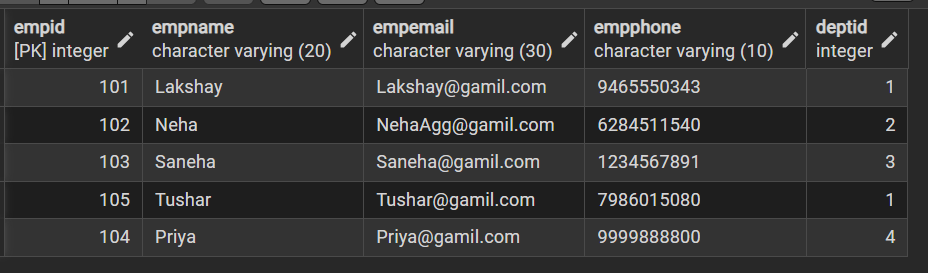
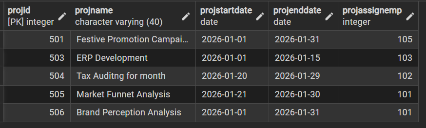

# Experiment 1 – DDL, DML and DCL Operations in SQL

---

## Student Information

- **Name:** Lakshay Aggarwal  
- **UID:** 25MCI10047  
- **Branch:** MCA (Artificial Intelligence & Machine Learning)  
- **Section:** MAM-1 A  
- **Semester:** Second Semester  
- **Subject:** Technical Training  
- **Date of Performance:** 07/01/2026  

---

##  Aim of the Session 

To design and implement a sample database system using DDL, DML, and DCL commands for managing departments, employees, and projects, and to apply role-based access control for secure data handling.

---

## Software Requirements
  
- PostgreSQL  
- pgAdmin  
- Windows Operating System  
---

## Objectives
- To understand the use of DDL commands to create and modify database structures.  
- To perform DML operations such as INSERT, UPDATE, DELETE, and SELECT.  
- To implement relationships using primary and foreign keys.  
- To apply DCL commands to manage roles and privileges.  
- To analyze input and output of SQL queries in a real database environment.  
---

##  Practical / Experiment Steps
- Design the database schema for Department, Employee, and Project tables.  
- Create tables using appropriate constraints.  
- Insert sample records into tables.  
- Perform update and delete operations.  
- Retrieve data using SELECT queries.  
- Create a role and grant and revoke privileges.  
- Alter and drop database objects.  

# Database Design

The database is designed to manage **Departments, Employees, and Projects** within an organization.

### Tables:
- Departments  
- Employees  
- Projects  

### Constraints Used:
- PRIMARY KEY  
- FOREIGN KEY  
- NOT NULL  
- UNIQUE  
- CHECK  

---
# ⚙️ **Procedure of the Practical**

# Step 1: Table Creation (DDL)

### Departments Table

```sql
create table Department 
(
Deptid int PRIMARY KEY,
Deptname varchar(20) NOT NULL UNIQUE
);
```

---

### Employees Table

```sql
CREATE TABLE Employee (
Empid int PRIMARY KEY,
Empname varchar(20) NOT NULL,
Empemail varchar(30) UNIQUE NOT NULL,
Empphone varchar(10) UNIQUE NOT NULL,
Deptid int,
FOREIGN KEY (Deptid) REFERENCES Department(Deptid)
);
```

---

### Projects Table

```sql
CREATE TABLE Project
(
Projid int PRIMARY KEY,
Projname varchar(40) NOT NULL,
ProjstartDate date NOT NULL,
ProjendDate date NOT NULL,
ProjAssignEmp int,
FOREIGN KEY (ProjAssignEmp) REFERENCES Employee(Empid)
);
```

---

# Step 2: Data Manipulation (DML)

### Insert Records

#### Departments

```sql
insert into Department (Deptid, Deptname) values
(1,'Marketing'),(2,'Finance'),(3,'IT'),(4,'HR');

```

---

#### Employees

```sql
insert into Employee(Empid, Empname, Empemail, Empphone, Deptid) values
(101,'Lakshay','Lakshay@gamil.com',9465550343,1),
(102,'Neha','NehaAgg@gamil.com',6284511540,2),
(103,'Saneha','Saneha@gamil.com',1234567891,3),
(104,'Priya','Priya@gamil.com',9876543210,4),
(105,'Tushar','Tushar@gamil.com',7986015080,1);
```

---

#### Projects

```sql
insert into Project(Projid, Projname, ProjstartDate, ProjendDate, ProjAssignEmp)values
(501,'Festive Promotion Campaign','2026-01-01','2026-01-31',105),
(502,'Payout Maintainence','2026-01-28','2026-01-31',104),
(503,'ERP Development','2026-01-01','2026-01-15',103),
(504,'Tax Auditng for month','2026-01-20','2026-01-29',102),
(505,'Market Funnet Analysis','2026-01-21','2026-01-30',101),
(506,'Brand Perception Analysis','2026-01-01','2026-01-31',101);
```

---


---

# Step 3: UPDATE Operations

```sql
UPDATE Employee
SET Empphone = 9999888800
WHERE Empid = 104;
```


---

# Step 4: DELETE Operations

```sql
DELETE FROM Project
WHERE ProjAssignEmp = 104;
```

---

## Output

```

```


---

# Step 5: Access Control & Security (DCL)

### Create Role

```sql
CREATE ROLE Auditor LOGIN PASSWORD 'Audit@2020';
```

---

### Grant SELECT Privileges

```sql
GRANT SELECT ON Department, Employee, Project TO Auditor;

```

---


### Enforce Read-Only Access

```sql
REVOKE SELECT ON Project FROM Auditor;

```
---

## 📥📤 I/O Analysis (Input / Output)

### 🔹 Input
- Department, Employee, and Project table creation queries  
- Records inserted into all tables using INSERT commands  
- Update query to modify employee department  
- Delete queries to remove project and employee records  
- Role creation and privilege assignment queries   

### 🔹 Output
- Department, Employee, and Project tables created successfully  
- Records inserted, updated, and deleted correctly  
- Referential integrity maintained between tables  
- Data displayed correctly using SELECT queries  
- Role-based access verified using GRANT and REVOKE  

📸 Screenshots of execution and obtained results are attached.

---
# Learning Outcomes

- Understood the basics of relational database design using tables, keys, and relationships.  
- Learned to apply primary and foreign key constraints to maintain data integrity.  
- Gained hands-on experience with INSERT, UPDATE, and DELETE operations.  
- Understood role-based access control using GRANT and REVOKE.  
- Learned how to create read-only users for secure data access.  
- Practiced ALTER TABLE and DROP TABLE commands for schema management.  

---

## Conclusion

This experiment provided practical exposure to core SQL concepts including DDL, DML, and DCL commands. It strengthened understanding of database security, referential integrity, and schema management, which are essential for real-world enterprise database systems.
