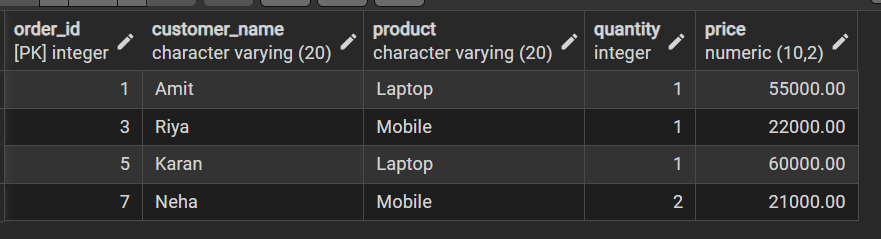
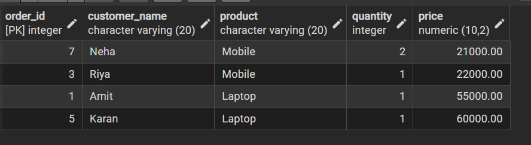
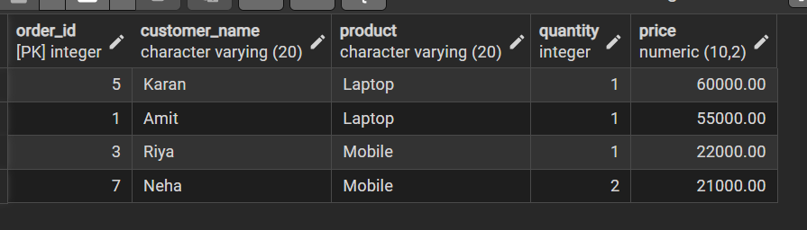
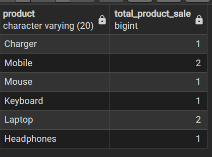
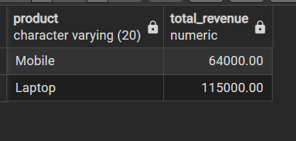

# Experiment 02 – SQL Filtering, Grouping and Sorting

## Student Information
- Name: Lakshay Aggarwal 
- UID: 25MCI10047  
- Branch: MCA (AI & ML)  
- Section: MAM-1 A  
- Semester: Second Semester  
- Subject: Technical Skills  
- Date of Performance: 12/01/2026  

---

## Aim
To design and implement a sample database system using SQL commands to perform filtering, sorting, grouping, and aggregation operations and to understand the difference between row-level and group-level filtering.

---

## Software Requirements
- PostgreSQL  
- pgAdmin  
- Oracle Database Express Edition (optional)

---

## Objectives
- Retrieve specific data using filtering conditions  
- Sort query results using single and multiple attributes  
- Perform aggregation using grouping techniques  
- Apply conditions on aggregated data  
- Understand real-world analytical SQL queries  

---

## Step 1: Table Creation

```sql
create table customer_orders(
order_id serial primary key,
customer_name varchar(20),
product varchar(20),
quantity int,
price numeric(10,2),
order_date date
);
```

---

## Step 1.1: Insert Sample Data

```sql
insert into customer_orders(customer_name,product,quantity,price,order_date) values
('Amit', 'Laptop', 1, 55000, '2025-01-05'),
('Amit', 'Mouse', 2, 800, '2025-01-06'),
('Riya', 'Mobile', 1, 22000, '2025-01-10'),
('Riya', 'Headphones', 1, 2000, '2025-01-10'),
('Karan', 'Laptop', 1, 60000, '2025-02-02'),
('Karan', 'Keyboard', 1, 1500, '2025-02-05'),
('Neha', 'Mobile', 2, 21000, '2025-02-15'),
('Neha', 'Charger', 3, 900, '2025-02-18');

```

### Output:

## Step 2: Filtering Data

```sql
select *from customer_orders where price>20000;
```

### Output:


---

## Step 3: Sorting Data

```sql
select order_id,customer_name,product,quantity,price
from customer_orders where price>20000 order by price ;
select order_id,customer_name,product,quantity,price
from customer_orders where price>20000 order by price desc;
```

### Output:



---

```sql
select product ,count(*)as total_product_sale
from customer_orders
group by product;
```

```sql
select product,
sum(quantity*price) as total_revenue
from customer_orders
group by product
having sum(quantity*price) > 50000;

```

### Output:



---

```sql
select product, sum(quantity*price) as total_revenue
from customer_orders
where order_date >= '2025-01-01'
group by product
having sum(quantity*price) > 50000;
```



