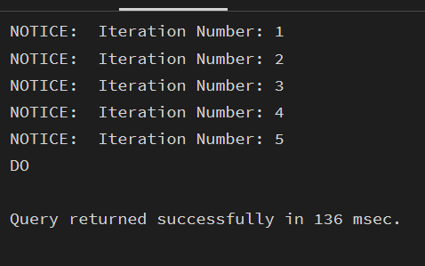
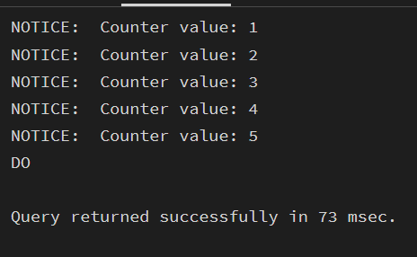
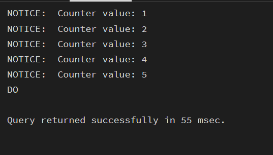
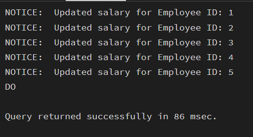

> **Student Name:** Lakshay Aggarwal 
> **UID:** 25MCI10047  
> **Branch:** MCA (AI & ML)  
> **Section/Group:** 25MAM_KAR-1  
> **Semester:** 2  
> **Date of Performance:** 3/2/26  
> **Subject Name:** Technical Training - I 
> **Subject Code:** 25CAP-652 

---

## EXPERIMENT - 04

**Implementation of Iterative Control Structures using FOR, WHILE, and LOOP in PostgreSQL** 

---

## Aim

To understand and implement iterative control structures in PostgreSQL conceptually, including FOR loops, WHILE loops, and basic LOOP constructs, for repeated execution of database logic. 

---

## Tools Used

- PostgreSQL 

---

## Objectives

- To understand why iteration is required in database programming.   
- To learn the purpose and behavior of FOR, WHILE, and LOOP constructs.   
- To understand how repeated data processing is handled in databases.   
- To relate loop concepts to real-world batch processing scenarios.   
- To strengthen conceptual knowledge of procedural SQL used in enterprise systems. 

---

## Experiment Steps

## Step 1: FOR Loop -- Simple Iteration

```sql
create table employees( 
e_id serial primary key,  
e_name varchar(50), 
e_salary numeric(10,2) 
); 
insert into employees (e_name, e_salary) values 
('Lakshay', 40000), 
('Neha', 50000), 
('Tushar', 48000), 
('Sam', 35000), 
('Diya', 49000); 
do $$ 
begin 
for i in 1..5 loop 
raise notice 'Iteration Number: %', i; 
end loop; 
end; 
$$ ; 

```
### Output-



---

### Example 2: FOR Loop with Query (Row-by-Row Processing)

```sql
do $$ 
declare 
    emp_rec RECORD; 
begin 
    for emp_rec in 
        select e_id, e_name from employees 
    loop 
        raise notice 'Employee ID: %, Name: %', emp_rec.e_id, emp_rec.e_name; 
    end loop; 
end; 
$$; 
``` 

### Output-
.png)
---

### Example 3: WHILE Loop -- Conditional Iteration

```sql
do $$ 
declare 
    counter INT := 1; 
begin 
    while counter <= 5 loop 
        raise notice 'Counter value: %', counter; 
        counter := counter + 1; 
    end loop; 
end; 
$$ ; 

``` 

### Output-

---

### Example 4: LOOP with EXIT WHEN

```sql
do $$ 
declare 
counter int := 1; 
begin 
loop 
raise notice 'Counter value: %', counter; 
counter := counter + 1; 
exit when counter > 5; 
end loop; 
end; 
$$ 
``` 

### Output-

---

### Example 5: Salary Increment Using FOR Loop

```sql
do $$ 
declare 
 emp_rec RECORD; 
begin 
    for emp_rec in 
        select e_id, e_salary from employees 
    loop 
        update employees 
        set e_salary = e_salary * 1.10 
        where e_id = emp_rec.e_id; 
 
        raise notice 'Updated salary for Employee ID: %', emp_rec.e_id; 
    end loop; 
end; 
$$ ; 
``` 

### Output-

---

### Example 6: Combining LOOP with IF Condition

```sql
do $$ 
declare 
 emp_rec RECORD; 
begin 
    for emp_rec in 
        select e_id, e_salary from employees 
    loop 
if emp_rec.e_salary > 50000 then 
raise notice 'Employee ID % has salary more than 50000', emp_rec.e_id; 
else 
raise notice 'Employee ID % has salary less than 50000', emp_rec.e_id; 
end if; 
end loop; 
end; 
$$;
``` 

### Output-

---

## Learning Outcomes

- Understand the need for iteration in database applications.
- Identify and use different loop types (FOR, WHILE, LOOP).
- Implement fixed and query-based repetition for row processing.
- Apply conditional and exit-controlled loops for automation tasks.
- Use PL/pgSQL loops in real-world scenarios like payroll, reporting, and batch processing.

---

## Conclusion

This experiment helps students understand how iterative control structures work in PostgreSQL at a conceptual level. Students learn where and why loops are used in database systems and gain foundational knowledge required for writing procedural logic in enterprise-grade applications. 
