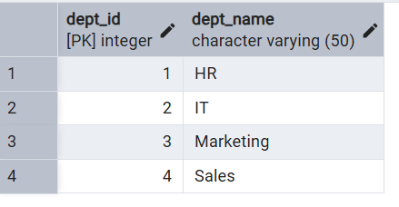
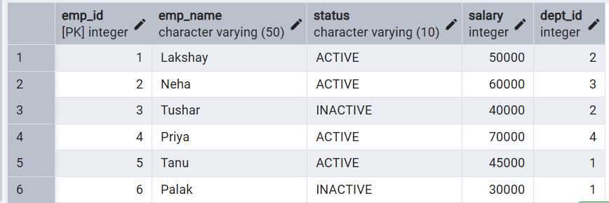
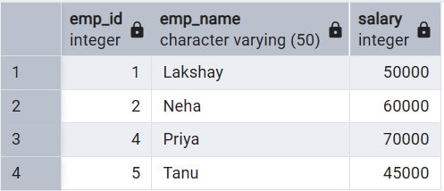
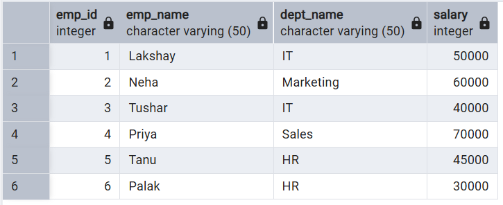
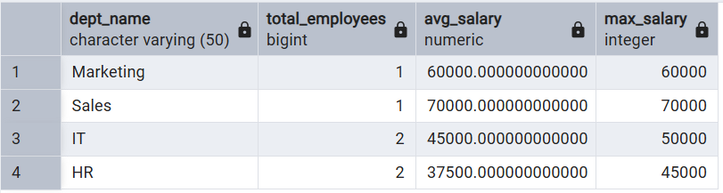

# **Technical training-1 – Worksheet 6**  

---

## 👨‍🎓 **Student Details**  
**Name:** Lakshay Aggarwal  
**UID:** 25MCI10047  
**Branch:** MCA (AI & ML)  
**Semester:** 2nd  
**Section/Group:** 25MAM1(A)  
**Subject:** Technical training -1  
**Date of Performance:** 03/03/2026  

---

## 🎯 **Aim of the Session**  
Learn how to create, query, and manage views in SQL to simplify database queries and provide a layer of abstraction for end-users.

---

## 💻 **Software Requirements**
- PostgreSQL (Database Server)  
- pgAdmin
- Windows Operating System  

---

## 📌 **Objectives**  
- Data Abstraction: To understand how to hide complex table joins and calculations behind a simple virtual table interface.
- Enhanced Security: To learn how to restrict user access to sensitive columns by providing views instead of direct table access.
- Query Simplification: To master the creation of views that pre-join multiple tables, making reporting easier for non-technical users.
- View Management: To understand the syntax for creating, altering, and dropping views, as well as the naming conventions required for efficient data access.

---

## 🛠️ **Theory**  
A View is essentially a virtual table based on the result-set of an SQL statement. It does not contain data of its own but dynamically pulls data from the underlying "base tables".
1. Simple Views: Created from a single table without any aggregate functions or grouping. These are often updatable.
2. Complex Views: Created from multiple tables using JOINs, or including GROUP BY and aggregate functions. These provide a consolidated summary of the database.
3. Security Layer: In enterprise environments, views are used to grant permissions on specific subsets of data. For example, a "SalaryView" might exclude the "Employee_SSN" or "Home_Address" columns for privacy.
4. Benefits: They simplify the user experience, ensure data consistency across reports, and reduce the risk of accidental data modification by providing read-only abstractions.

---

# ⚙️ **Practical/Experiment Steps**

## Step 0: Creating sample tables and inserting records

**Code**
```sql
CREATE TABLE departments (
    dept_id SERIAL PRIMARY KEY,
    dept_name VARCHAR(50)
);

CREATE TABLE employees (
    emp_id SERIAL PRIMARY KEY,
    emp_name VARCHAR(50),
    status VARCHAR(10),        
    salary INT,
    dept_id INT REFERENCES departments(dept_id)
);

INSERT INTO departments (dept_name) VALUES
('HR'),
('IT'),
('Marketing'),
('Sales');

INSERT INTO employees (emp_name, status, salary, dept_id) VALUES
('Lakshay', 'ACTIVE', 50000, 2),
('Neha', 'ACTIVE', 60000, 3),
('Tushar', 'INACTIVE', 40000, 2),
('Priya', 'ACTIVE', 70000, 4),
('Tanu', 'ACTIVE', 45000, 1),
('Palak', 'INACTIVE', 30000, 1);


SELECT * FROM departments;
SELECT * FROM employees;
```
**Output**
<br>



---

## Step 1: Creating a Simple View for Data Filtering
Implementing a view to provide a quick list of active employees without exposing the entire table structure.<br>

**Code**
```sql
CREATE VIEW active_employees AS
SELECT emp_id, emp_name, salary
FROM employees
WHERE status = 'ACTIVE';

SELECT * FROM active_employees;
```
**Output**
<br>


---

## Step 2: Creating a View for Joining Multiple Tables
Simplifying the retrieval of data distributed across Employees and Departments tables.<br>

**Code**
```sql
CREATE VIEW employee_department_view AS
SELECT 
    e.emp_id,
    e.emp_name,
    d.dept_name,
    e.salary
FROM employees e
JOIN departments d
ON e.dept_id = d.dept_id;

SELECT * FROM employee_department_view;
```
**Output**
<br>


---

## Step 3: Advanced Summarization View
Creating a view to provide department-level statistics automatically.<br>

**Code**
```sql
CREATE VIEW department_statistics AS
SELECT
    d.dept_name,
    COUNT(e.emp_id) AS total_employees,
    AVG(e.salary) AS avg_salary,
    MAX(e.salary) AS max_salary
FROM departments d
LEFT JOIN employees e
ON d.dept_id = e.dept_id
GROUP BY d.dept_name;

SELECT * FROM department_statistics;
```
**Output**
<br>


---

## 📘 **Learning Outcomes**  
- Abstraction Proficiency: Students will be able to create and query views to simplify efficient data access and abstraction.
- Security Implementation: Students will understand how to use views for data masking and providing restricted access to sensitive information.
- Syntactic Accuracy: Students will demonstrate the correct syntax for creating and querying views, ensuring logical clarity in naming conventions.
- Real-world Application: Students will be able to design views for practical domains like Library Management Systems or Payroll Systems to demonstrate functionality.
---
