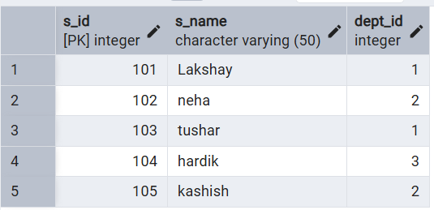
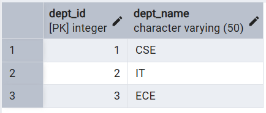
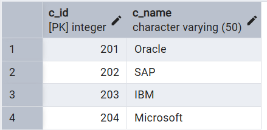
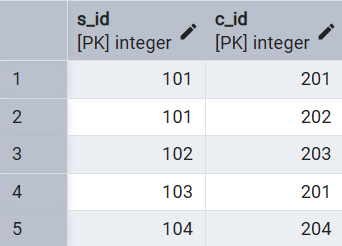
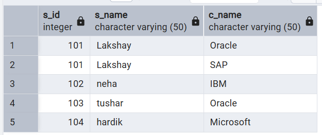
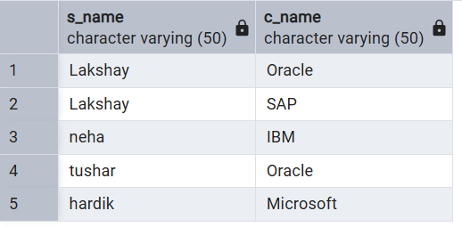
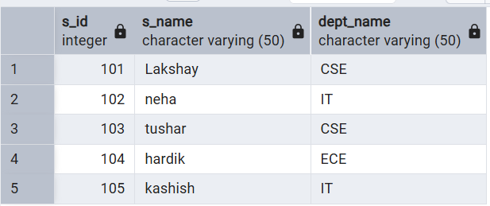
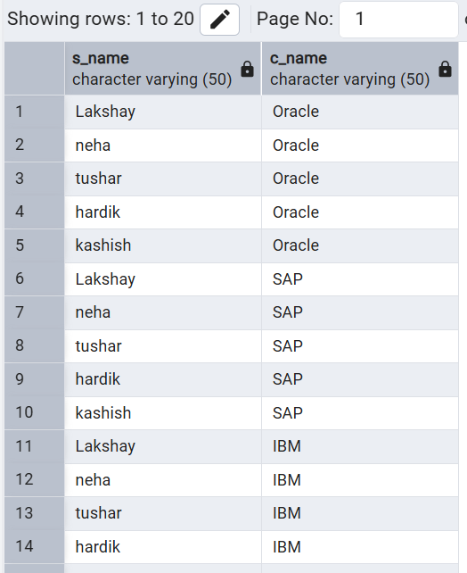

# **Technical training-1 – Worksheet 7**  

---

## 👨‍🎓 **Student Details**  
**Name:** Lakshay Aggarwal  
**UID:** 25MCI10047  
**Branch:** MCA (AI & ML)  
**Semester:** 2nd  
**Section/Group:** 25MAM1(A)  
**Subject:** Technical training -1  
**Date of Performance:** 31/03/2026  

---

## 🎯 **Aim of the Session**  
Implementation of joins in PostgreSQL (INNER JOIN, LEFT JOIN, RIGHT JOIN, SELF JOIN and CROSS JOIN).

---

## 💻 **Software Requirements**
- PostgreSQL (Database Server)  
- pgAdmin  
- Windows Operating System  

---

## 📌 **Objectives**  
- Join Understanding: To understand how different SQL joins combine data from multiple related tables.
- Real-world Schema Application: To apply joins on a practical database schema involving Students, Courses, Enrollments, and Departments.
- Data Retrieval Skills: To learn how to fetch matching and non-matching records using INNER JOIN, LEFT JOIN, and RIGHT JOIN.
- Advanced Querying: To understand the use of SELF JOIN for hierarchical relationships and CROSS JOIN for generating all possible combinations of rows.

---

## 🛠️ **Theory**  
A JOIN in SQL is used to combine rows from two or more tables based on a related column between them.  
Joins are essential in relational databases because data is often stored in multiple tables to reduce redundancy and improve organization.

### Types of Joins Used in this Experiment:
1. **INNER JOIN:**  
   Returns only the matching records from both tables.

2. **LEFT JOIN:**  
   Returns all records from the left table and the matching records from the right table. If no match is found, NULL values are returned for the right table columns.

3. **RIGHT JOIN:**  
   Returns all records from the right table and the matching records from the left table. If no match is found, NULL values are returned for the left table columns.

4. **SELF JOIN:**  
   A table is joined with itself to represent relationships within the same table, such as mentor-student or manager-employee relationships.

5. **CROSS JOIN:**  
   Returns the Cartesian product of two tables, i.e., all possible combinations of rows from both tables.

---

# ⚙️ **Practical/Experiment Steps**

## Step 0: Creating sample tables and inserting records

**Code**
   
     CREATE TABLE student(
        s_id INT PRIMARY KEY,
        s_name VARCHAR(50),
        dept_id INT
    );
    
    CREATE TABLE department(
        dept_id INT PRIMARY KEY,
        dept_name VARCHAR(50)
    );

    CREATE TABLE course(
        c_id INT PRIMARY KEY,
        c_name VARCHAR(50)
    );

    CREATE TABLE enrollment(
        s_id INT,
        c_id INT,
        PRIMARY KEY (s_id, c_id),
        FOREIGN KEY (s_id) REFERENCES student(s_id),
        FOREIGN KEY (c_id) REFERENCES course(c_id)
    );

    INSERT INTO department VALUES (1, 'CSE');
    INSERT INTO department VALUES (2, 'IT');
    INSERT INTO department VALUES (3, 'ECE');

    INSERT INTO student VALUES (101, 'Lakshay', 1);
    INSERT INTO student VALUES (102, 'Neha', 2);
    INSERT INTO student VALUES (103, 'Tushar', 1);
    INSERT INTO student VALUES (104, 'Hardik', 3);
    INSERT INTO student VALUES (105, 'Kashish', 2);

    INSERT INTO course VALUES (201, 'Oracle');
    INSERT INTO course VALUES (202, 'SAP');
    INSERT INTO course VALUES (203, 'IBM');
    INSERT INTO course VALUES (204, 'Microsoft');

    INSERT INTO enrollment VALUES (101, 201);
    INSERT INTO enrollment VALUES (101, 202);
    INSERT INTO enrollment VALUES (102, 203);
    INSERT INTO enrollment VALUES (103, 201);
    INSERT INTO enrollment VALUES (104, 204);

    SELECT * FROM student;
    SELECT * FROM department;
    SELECT * FROM course;
    SELECT * FROM enrollment;

**Output**  
 

---

## Step 1: Listing students with their enrolled courses (INNER JOIN)
Implementing INNER JOIN to display only those students who are enrolled in one or more courses. 

**Code**

        SELECT s.s_id, s.s_name, c.c_name
        FROM student s
        INNER JOIN enrollment e ON s.s_id = e.s_id
        INNER JOIN course c ON e.c_id = c.c_id;

**Output**  
 

---

## Step 2: Finding students not enrolled in any course (LEFT JOIN)
Using LEFT JOIN to identify students who do not have any matching record in the enrollment table. 

**Code**

    SELECT s.s_id, s.s_name
    FROM student s
    LEFT JOIN enrollment e ON s.s_id = e.s_id
    WHERE e.c_id IS NULL;

**Output**  
 

---

## Step 3: Displaying all courses with or without enrolled students (RIGHT JOIN)
Using RIGHT JOIN to show all courses, including those that do not have any students enrolled. 

**Code**

    SELECT s.s_name, c.c_name
    FROM enrollment e
    RIGHT JOIN course c ON e.c_id = c.c_id
    LEFT JOIN student s ON e.s_id = s.s_id;

**Output**  
 

---

## Step 4: Showing students with department information (Multiple Join / Equivalent to practical relationship join)
Joining Students and Department tables to display each student along with their department name. 

**Code**

    SELECT s.s_id, s.s_name, d.dept_name
    FROM student s
    INNER JOIN department d ON s.dept_id = d.dept_id;

**Output**  
 

---

## Step 5: Displaying all possible student-course combinations (CROSS JOIN)
Using CROSS JOIN to generate all possible combinations of students and courses. 

**Code**

    SELECT s.s_name, c.c_name
    FROM student s
    CROSS JOIN course c;

**Output**  
 

---

## 📘 **Learning Outcomes**  
- Join Understanding: Students will be able to differentiate between INNER JOIN, LEFT JOIN, RIGHT JOIN, SELF JOIN, and CROSS JOIN based on their output behavior.
- Practical Database Skills: Students will understand how relational database tables are linked using foreign keys and how joins retrieve meaningful data.
- Query Writing Ability: Students will gain confidence in writing SQL queries that combine data from multiple tables.
- Real-world Application: Students will be able to apply joins in practical systems such as Student Management, Employee Management, or Course Enrollment systems.
- PostgreSQL Practice: Students will get hands-on experience executing SQL join queries in PostgreSQL / pgAdmin.

---
