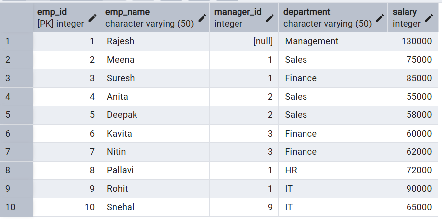
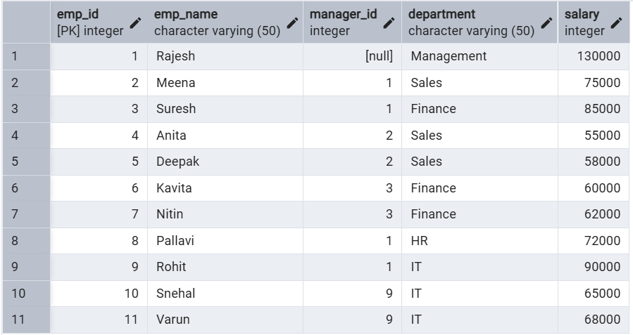
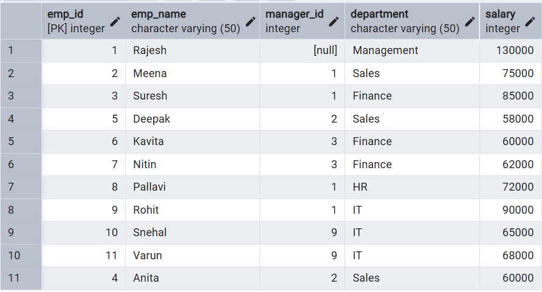
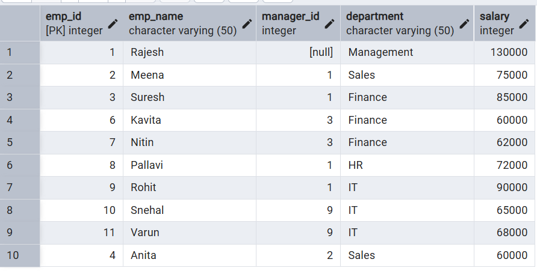
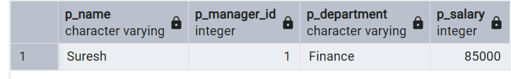

# **Technical training-1 – Worksheet 8**  

---

## 👨‍🎓 **Student Details**  
**Name:** Lakshay Aggarwal  
**UID:** 25MCI10047  
**Branch:** MCA (AI & ML)  
**Semester:** 2nd  
**Section/Group:** 25MAM1(A)  
**Subject:** Technical training -1  
**Date of Performance:** 31/03/2026  

---

## 🎯 **Aim of the Session**  
Implementation of Stored Procedures in PostgreSQL to perform database operations such as insertion, updating, deletion, and retrieval of employee data efficiently and securely.

---

## 💻 **Software Requirements**
- PostgreSQL  
- pgAdmin  
- Windows Operating System  

---

## 📌 **Objectives**  
- Stored Procedure Understanding: To understand the concept of stored procedures in PostgreSQL and how they simplify database operations.
- CRUD Operations with Procedures: To perform Insert, Update, Delete, and Retrieve operations using stored procedures.
- Parameter Handling: To learn the use of IN, OUT, and INOUT parameters in stored procedures.
- Reusability and Efficiency: To create reusable procedural code for repeated database tasks.
- PL/pgSQL Practice: To gain hands-on experience in writing stored procedures using PL/pgSQL syntax.

---

## 🛠️ **Theory**  
A **Stored Procedure** is a precompiled set of SQL statements stored inside the database that can be executed whenever required.  
It is used to perform one or more database operations such as:

1. **INSERT**  
2. **UPDATE**  
3. **DELETE**  
4. **RETRIEVE / SELECT**  

Instead of writing the same SQL query repeatedly, we can create a stored procedure once and call it multiple times whenever needed.  
Stored procedures improve code reusability, maintainability, and security in database applications.

### Features of Stored Procedure:
- Stored inside the database
- Can accept parameters
- Can perform CRUD operations
- Can return values using OUT or INOUT parameters
- Can include conditional statements like IF, CASE
- Can handle exceptions / errors

---

# ⚙️ **Practical/Experiment Steps**

## Step 0: Creating Employees table and inserting records

**Code**

    CREATE TABLE Employees (
        emp_id INT PRIMARY KEY,
        emp_name VARCHAR(50),
        manager_id INT,
        department VARCHAR(50),
        salary INT
    );

    INSERT INTO Employees VALUES
    (1, 'Rajesh', NULL, 'Management', 130000),
    (2, 'Meena', 1, 'Sales', 75000),
    (3, 'Suresh', 1, 'Finance', 85000),
    (4, 'Anita', 2, 'Sales', 55000),
    (5, 'Deepak', 2, 'Sales', 58000),
    (6, 'Kavita', 3, 'Finance', 60000),
    (7, 'Nitin', 3, 'Finance', 62000),
    (8, 'Pallavi', 1, 'HR', 72000),
    (9, 'Rohit', 1, 'IT', 90000),
    (10, 'Snehal', 9, 'IT', 65000);

    SELECT * FROM Employees;

**Output**  
 

---

## Step 1: Insertion of record using Stored Procedure
Creating a stored procedure to insert a new employee record into the Employees table. 

**Code**

    CREATE OR REPLACE PROCEDURE add_employee(
        p_id INT,
        p_name VARCHAR,
        p_manager INT,
        p_dept VARCHAR,
        p_salary INT
    )
    LANGUAGE plpgsql
    AS $$
    BEGIN
        INSERT INTO Employees VALUES (p_id, p_name, p_manager, p_dept, p_salary);
    END;
    $$;

    CALL add_employee(11, 'Varun', 9, 'IT', 68000);

**Output**  
 

---

## Step 2: Updating salary of employee using Stored Procedure
Using a stored procedure with IN, INOUT, and OUT parameters to update the salary of an employee and return the updated salary along with the status. 

**Code**

    CREATE OR REPLACE PROCEDURE update_salary_procc(
        IN p_emp_id INT,
        INOUT p_salary NUMERIC(20,3),
        OUT status VARCHAR(20)
    )
    AS
    $$
    DECLARE
        curr_sal NUMERIC(20,3);

    BEGIN
        SELECT salary + p_salary
        INTO curr_sal
        FROM employees
        WHERE emp_id = p_emp_id;

        IF NOT FOUND THEN
            RAISE EXCEPTION 'EMPLOYEE NOT FOUND';
        END IF;

        UPDATE employees
        SET salary = curr_sal
        WHERE emp_id = p_emp_id;

        p_salary := curr_sal;
        status := 'SUCCESS';

    EXCEPTION
        WHEN OTHERS THEN
            IF SQLERRM LIKE '%EMPLOYEE NOT FOUND%' THEN
                status := 'EMPLOYEE NOT FOUND';
            ELSE
                status := 'FAILED';
            END IF;
    END;
    $$
    LANGUAGE plpgsql;

    CALL update_salary_procc(4, 5000, NULL);

**Output**  
 

---

## Step 3: Deleting the record of employee using Stored Procedure
Creating a stored procedure to delete an employee record from the Employees table based on employee ID. 

**Code**

    CREATE OR REPLACE PROCEDURE delete_employee(
        p_id INT
    )
    LANGUAGE plpgsql
    AS $$
    BEGIN
        DELETE FROM Employees
        WHERE emp_id = p_id;
    END;
    $$;

    CALL delete_employee(5);

**Output**  
 

---

## Step 4: Retrieving the information of a particular employee using Stored Procedure
Using a stored procedure with OUT parameters to retrieve details of a specific employee by employee ID. 

**Code**

    CREATE OR REPLACE PROCEDURE get_employee_by_id(
        IN p_emp_id INT,
        OUT p_name VARCHAR(50),
        OUT p_manager_id INT,
        OUT p_department VARCHAR(50),
        OUT p_salary INT
    )
    LANGUAGE plpgsql
    AS $$
    BEGIN
        SELECT emp_name, manager_id, department, salary
        INTO p_name, p_manager_id, p_department, p_salary
        FROM Employees
        WHERE emp_id = p_emp_id;
    END;
    $$;

    CALL get_employee_by_id(3, NULL, NULL, NULL, NULL);

**Output**  
 

---

## 📘 **Learning Outcomes**  
- Stored Procedure Understanding: Students will be able to understand the concept and purpose of stored procedures in PostgreSQL.
- CRUD Operations Knowledge: Students will learn how to perform Insert, Update, Delete, and Retrieve operations using stored procedures.
- Parameter Handling Skills: Students will understand the use of IN, OUT, and INOUT parameters for passing and returning values in procedures.
- Practical Database Skills: Students will gain hands-on experience in managing employee data using procedural SQL code.
- Error Handling Awareness: Students will understand how exceptions can be handled inside stored procedures.
- PostgreSQL / pgAdmin Practice: Students will improve their practical skills in creating, executing, and testing stored procedures in PostgreSQL / pgAdmin.

---
