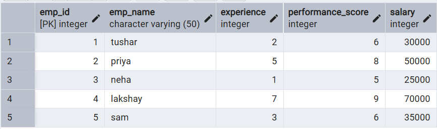
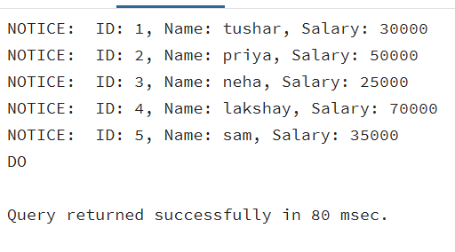
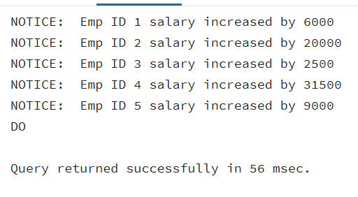
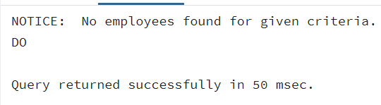

# **Technical training-1 – Worksheet 5**  

---

## 👨‍🎓 **Student Details**  
**Name:** Lakshay Aggarwal  
**UID:** 25MCI10047  
**Branch:** MCA (AI & ML)  
**Semester:** 2nd  
**Section/Group:** 25MAM1(A)  
**Subject:** Technical training -1  
**Date of Performance:** 03/03/2026  

---

## 🎯 **Aim of the Session**  
To gain hands-on experience in creating and using cursors for row-by-row processing in a database, enabling sequential access and manipulation of query results for complex business logic.

---

## 💻 **Software Requirements**
- PostgreSQL (Database Server)  
- pgAdmin
- Windows Operating System  

---

## 📌 **Objectives**  
- Sequential Data Access: To understand how to fetch rows one by one from a result set using cursor mechanisms.
- Row-Level Manipulation: To perform specific operations or calculations on individual records that require conditional procedural logic.
- Resource Management: To learn the lifecycle of a cursor: Declaring, Opening, Fetching, and importantly, Closing and Deallocating to manage system memory.
- Exception Handling: To handle cursor-related errors and performance considerations during large-scale data iteration.

---

## 🛠️ **Theory**  
While SQL is generally set-oriented, certain tasks require a procedural approach where we process one row at a time. This is where Cursors are used:
1. Cursor Types: Cursors can be Implicit (managed by the system) or Explicit (defined by the developer). They can also be Forward-Only (moving only toward the end) or Scrollable (moving back and forth).
2. The Lifecycle: 
- DECLARE: Defines the SQL query for the cursor.
- OPEN: Executes the query and establishes the result set.
- FETCH: Retrieves a specific row into variables for processing.
- CLOSE: Releases the current result set.
- DEALLOCATE: Removes the cursor definition from memory.
3. Use Case: Cursors are ideal for generating row-specific reports, updating balances based on complex historical data, or migrating data where each record needs individual validation.

---

# ⚙️ **Practical/Experiment Steps**

## Step 0: Creating a sample table and inserting records

**Code**
```sql
CREATE TABLE employee(
emp_id serial primary key,
emp_name varchar(50),
experience int,
performance_score int,
salary int
);

INSERT INTO employee (emp_name, experience, performance_score, salary) VALUES
('tushar', 2, 6, 30000),
('priya', 5, 8, 50000),
('neha', 1, 5, 25000),
('lakshay', 7, 9, 70000),
('sam', 3, 6, 35000);

SELECT * FROM employee;
```
**Output**
<br>


---

## Step 1: Implementing a single Forward-only cursor
Creating a cursor to loop through an Employee table and print individual records.<br>

**Code**
```sql
DO $$
DECLARE
    emp_rec RECORD;
    emp_cursor CURSOR FOR
        SELECT emp_id, emp_name, salary FROM employee;
BEGIN
    OPEN emp_cursor;
    LOOP
        FETCH emp_cursor INTO emp_rec;
        EXIT WHEN NOT FOUND;
        RAISE NOTICE 'ID: %, Name: %, Salary: %',
            emp_rec.emp_id,
            emp_rec.emp_name,
            emp_rec.salary;
    END LOOP;
    CLOSE emp_cursor;
END $$;
```
**Output**
<br>


---

## Step 2: Complex Row-by-Row Manipulation
Using a cursor to update salaries based on a dynamic "Experience-to-Performance" ratio logic.<br>

**Code**
```sql
DO $$
DECLARE
    emp_rec RECORD;
    increment_amount INT;
    emp_cursor CURSOR FOR
        SELECT emp_id, experience, performance_score, salary
        FROM employee;
BEGIN
    OPEN emp_cursor;
    LOOP
        FETCH emp_cursor INTO emp_rec;
        EXIT WHEN NOT FOUND;
        increment_amount :=
            emp_rec.experience * emp_rec.performance_score * 500;
        UPDATE employee
        SET salary = salary + increment_amount
        WHERE emp_id = emp_rec.emp_id;
        RAISE NOTICE 'Emp ID % salary increased by %',
            emp_rec.emp_id,
            increment_amount;
    END LOOP;
    CLOSE emp_cursor;
END $$;
```
**Output**
<br>


---

## Step 3: Exception and Status Handling
Ensuring the cursor handles empty result sets or termination signals gracefully.<br>

**Code**
```sql
DO $$
DECLARE
    emp_rec RECORD;
    emp_found BOOLEAN := FALSE;
    emp_cursor CURSOR FOR
        SELECT * FROM employee WHERE experience > 20;
BEGIN
    OPEN emp_cursor;
    LOOP
        FETCH emp_cursor INTO emp_rec;
        EXIT WHEN NOT FOUND;
        emp_found := TRUE;
        RAISE NOTICE 'Employee: %, Experience: %',
            emp_rec.emp_name,
            emp_rec.experience;
    END LOOP;
    CLOSE emp_cursor;
    IF emp_found = FALSE THEN
        RAISE NOTICE 'No employees found for given criteria.';
    END IF;
EXCEPTION
    WHEN OTHERS THEN
        RAISE NOTICE 'Error occurred: %', SQLERRM;
END $$;
```
**Output**
<br>


---

## 📘 **Learning Outcomes**  
- Cursor Implementation: Students will be able to design, implement, and manage cursors to solve row-wise processing problems.
- Lifecycle Mastery: Students will demonstrate the correct syntax for declaring, opening, fetching, and closing cursors.
- Error Prevention: Students will understand how to properly handle row-by-row processing exceptions and prevent memory leaks via deallocation.
- Analytical Thinking: Students will be able to apply cursor-based logic to solve real-world scenarios like multi-level payroll adjustments or data migrations.
---
